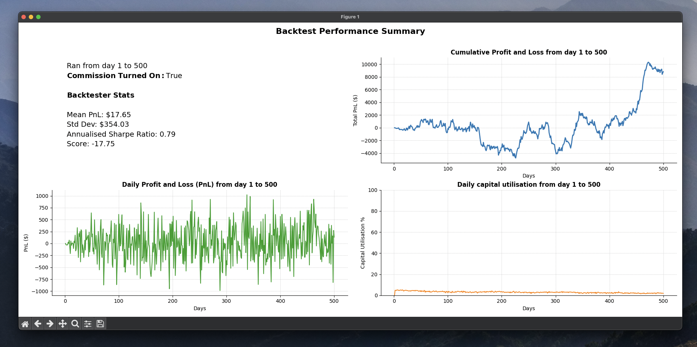

# 📊 John's Algothon 2025 Backtester

An comprehensive and open-source backtester configured specifically for the UNSW x Susquehanna 
International Group Algothon 2025. This repository provides an plug-and-play backtester that 
simulates your trading strategy against the supplied price data and outputs insightful results 
such as cumulative PnL, sharpe ratio and capital utilisation.

### ✅ Why Use it?
Most teams will need to build a backtester from scratch. This one's ready to go:

- Easily run it from the command line to gain insights about your trading strategies fast
- Alternatively, import the Backtester() class into your python files / Jupyter Notebooks to 
  access the wide range of insightful plotting and backtester summary functions
- Saves time so you and your team can focus on your strategy, not infrastructure

### 🤝 Why I made this:
I'm also competing, but I realised everyone is going to waste time reinventing the same tool. 
Most teams will rush building a backtester that may be faulty or fragile.

So I built this solid version for the community to use - both to help people out and as a 
personal project I can showcase here on GitHub!

### 🔨 Setup
1. Create a backtester.py file in your local repository
2. Locate the backtester.py file in this repository and copy its contents into your local 
   backtester.py
3. Install the dependencies: Numpy, Maplotlib and Pandas

```shell
pip install numpy matplotlib pandas
```

4. Make sure your main.py file that contains your getMyPosition() function is in the same 
   directory as your backtester.py. Alternatively, you can supply a filepath to your python file 
   that includes this function (see usage below) 
5. Make sure your prices.txt file is in the same directory as your backtester.py file

### 👾 Basic Usage (Command Line)
Once you've completed all the setup steps. You can run the backtester by typing the below into 
your command line:
```shell
python backtester.py
```
This runs your trading strategy on all instruments throughout the whole timeline of price data 
that the competition organisers supplied to us, which shows the following dashboard



Alternatively, you can specify a timeline that you would like to run the backtester on using the 
`--timeline` option
```shell
python backtester.py --timeline 200 400
```
This will run the backtester from day 200 to 400.
