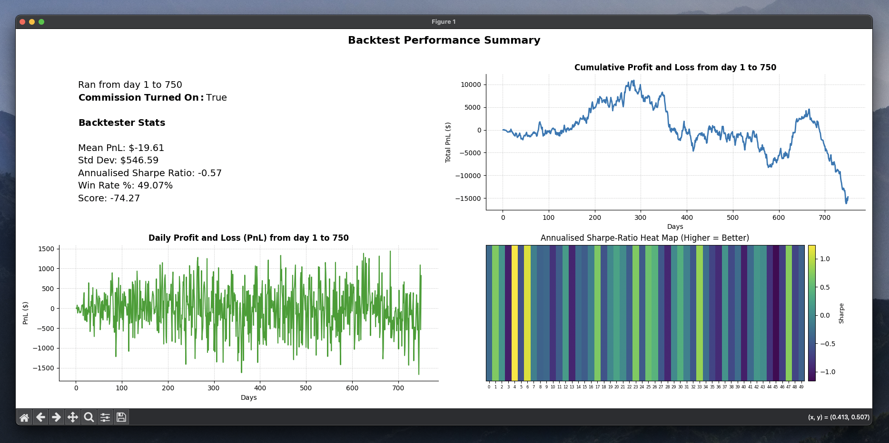
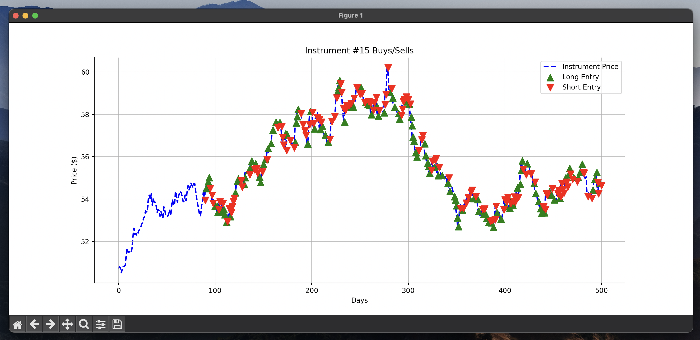

# 📊 John's Algothon 2025 Backtester

A comprehensive and open-source backtester configured specifically for the UNSW x Susquehanna 
International Group Algothon 2025. This repository provides an plug-and-play backtester that 
simulates your trading strategy against the supplied price data and outputs insightful results 
such as cumulative PnL, sharpe ratio and capital utilisation.

### ✅ Why Use it?
Most teams will need to build a backtester from scratch. This one's ready to go:

- Easily run it from the command line to gain insights about your trading strategies fast
- Alternatively, import the Backtester() class into your python files / Jupyter Notebooks to 
  access the wide range of insightful plotting and backtester summary functions
- Saves time so you and your team can focus on your strategy, not infrastructure

### 🤝 Why I made this:
I'm also competing, but I realised everyone is going to waste time reinventing the same tool. 
Most teams will rush building a backtester that may be faulty or fragile.

So I built this solid version for the community to use - both to help people out and as a 
personal project I can showcase here on GitHub!

### 🔨 Setup
1. Create a backtester.py file in your local repository
2. Locate the backtester.py file in this repository and copy its contents into your local 
   backtester.py
3. Install the dependencies: Numpy, Maplotlib and Pandas

```shell
pip install numpy matplotlib pandas
```

4. Make sure your main.py file that contains your getMyPosition() function is in the same 
   directory as your backtester.py. Alternatively, you can supply a filepath to your python file 
   that includes this function (see usage below) 
5. Make sure your prices.txt file is in the same directory as your backtester.py file

### 👾 Command Line Usage
Once you've completed all the setup steps. You can run the backtester by typing the below into 
your command line:
```shell
python backtester.py
```
This runs your trading strategy on all instruments throughout the whole timeline of price data 
that the competition organisers supplied to us, which shows the following dashboard



After exiting the dashboard, the backester will also show you a graph that plots your buys/sells 
for each instrument over the timeline - making it easier for you to spot where your algorithm 
may be going wrong.



To switch between instruments, use the left and right arrow keys on your keyboard.

**Specifying a timeline**

You can specify a timeline that you would like to run the backtester on using the 
`--timeline` option
```shell
python backtester.py --timeline 200 400
```
This will run the backtester from day 200 to 400.

**Turning Off Commissions**

You can also turn off the 5 basis points commission that is imposed for every trade you make 
using the `--disable-comms` option

```shell
python backtester.py --disable-comms
```

**Specifying the graphs to be shown**

In the Backtester Dashboard, you can choose up to 3 graphs to be shown. By default, it will show cumulative PnL,
sharpe ratio heat map and daily PnL. 

To specify the graphs you would like to see, you can use the `--show` option:

```shell
python backtester.py --show [GRAPH_1] [GRAPH_2: optional] [GRAPH_3: optional]
```

When `--show` is specified, you must at least specify one graph and have a max of 3. The available graphs to choose from are:

- `daily-pnl`: Plots your daily profit and loss over the timeline
- `cum-pnl`: Plots your cumulative profit and loss over the timeline
- `capital-util`: Plots your daily capital utilisation over the timeline
- `cum-sharpe`: Plots your cumulative sharpe ratio over the timeline
- `sharpe-heat-map`: Shows a heatmap of each instrument and their respective sharpe ratio

**Providing a different filepath to your getMyPositions() function**

If you have your `getMyPositions()` function in a different filepath, you can run a backtest on 
that function by providing the filepath to it.

```shell
python backtester.py --path [FILEPATH]
```

**Providing an alternative name to getMyPositions()**

If you have a function that acts like `getMyPositions()` - returns positions for all 50 assets - 
but is called something else, you can run a backtest on it using the commands below

```shell
python backtester.py --function-name [FUNCTION NAME: do not include the ()]
```

**Super Example**

Suppose we want to run a backtest from day 150 to 200 and we have a function called 
`get_johns_positions()` that returns an `ndarray` of positions located in filepath `..
/john/johns_strategy.py`.

```shell
python backtester.py --timeline 150 200 --path "../john/johns_strategy.py" --function-name 
get_johns_position
```
